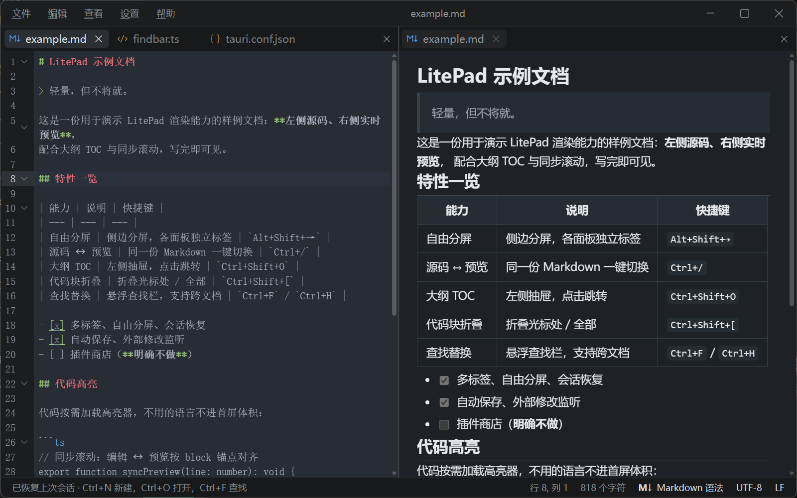

  
  <h1>LitePad</h1>
  
<b>轻量，但不将就。</b>

  
面向 Windows 的 Markdown / 纯文本编辑器

---

## 为什么是 LitePad

启动快、装完就能用、不联网也能用。它是一把称手的文本编辑器，顺手把 Markdown 写好了：
左侧写源码，右侧即时成稿；关掉窗口再打开，标签、光标、分屏和视图模式都在原处。

没有插件商店，没有账号，没有内置终端，也没有 Git 面板 —— 只做编辑器该做的事。

## 特性

**文件与编码**

- 自动识别 9 种常用字符编码，保存前对不可逆的转换给出确认
- 行尾自动识别 LF / CRLF / 混合；保存时还原文件原有的行尾
- 原子写入，断电或崩溃不会留下半截文件
- 二进制与超大文件会先给出提示，误开也不会弄坏编辑缓冲

**编辑器**

- 行号、代码折叠、括号匹配与自动闭合、列编辑、多级撤销
- 55 类语言的语法高亮，按需加载
- 多标签；同一个文件可以同时在多个面板打开，各自独立滚动、内容自动同步
- 自由分屏：任意方向拆分、拖拽比例、树形嵌套
- 悬浮查找替换栏，支持正则、全词匹配与跨文档查找
- 会话恢复：标签、光标位置、分屏布局、Markdown 视图模式
- 未保存的改动不会丢：关窗不再追问，下次打开原样接着改（连没起过名字的草稿也在）
- 可选让改动即时写回文件；文件在外部被修改时会提示

**Markdown**

- GFM：表格、删除线、任务列表、脚注
- 实时预览增量更新，编辑与预览双向同步滚动
- 大纲 TOC 抽屉，点击即跳转
- 数学公式（KaTeX）、代码高亮（Shiki）、Mermaid 图表，用到才加载
- 粘贴截图自动存入 `assets/` 并插入相对链接
- 导出为自包含单文件 HTML，或经系统打印输出 PDF

**界面**

- 浅色 / 深色 / 跟随系统；字号、编辑器字体、行距、预览行距均可调
- 菜单栏并入标题栏（右侧是最小化 / 最大化 / 关闭），底部状态栏（行列 / 字符数 / 语言 / 编码 / 行尾）
- 全部命令都能在命令面板里搜到，不用翻菜单
- 快捷键可重新绑定，自带冲突检测与一键恢复默认
- 标签栏放不下时横向滚动，当前标签始终可见

## 技术栈

| 层 | 选型 |
| --- | --- |
| 外壳 | Tauri 2 |
| 前端 | Vite 6 + TypeScript |
| 编辑内核 | CodeMirror 6 |
| Markdown | markdown-it + GFM 插件；Shiki / KaTeX / Mermaid 按需加载 |
| 编码 | encoding_rs + chardetng |

---

  LitePad · <a href="https://github.com/oh-myfun/LitePad">github.com/oh-myfun/LitePad</a>

