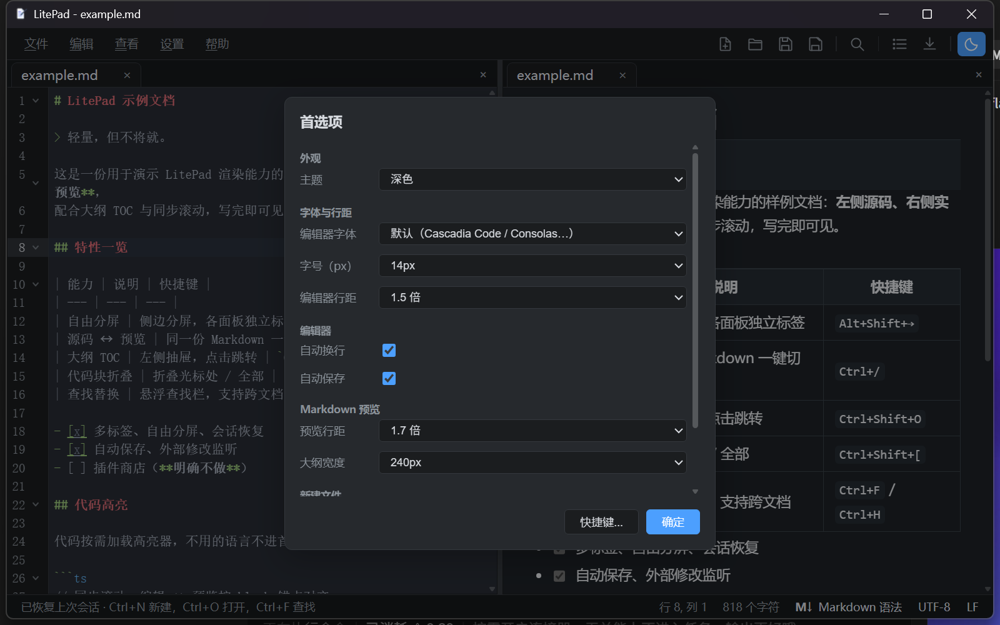
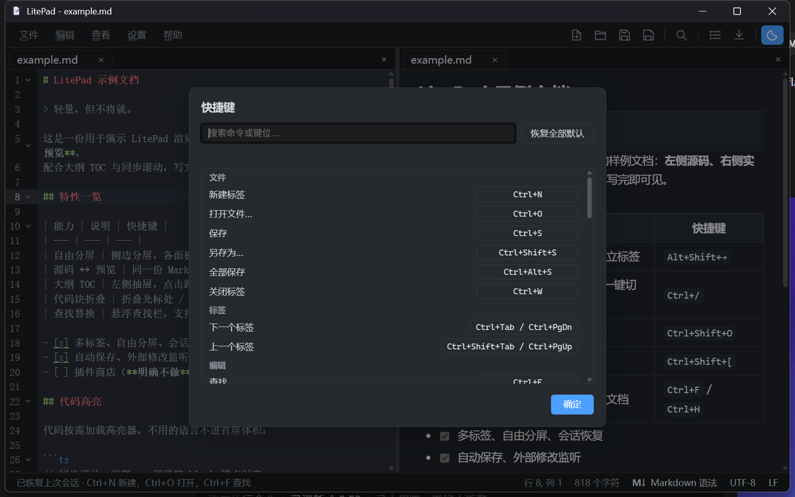
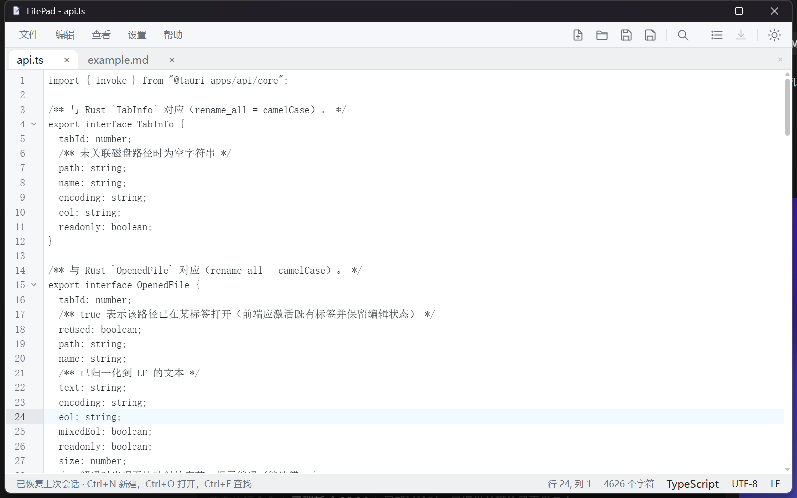

<div align="center">
  
  <h1>LitePad</h1>
  <p><b>轻量，但不将就。</b></p>
  <p>面向 Windows 的 Markdown / 纯文本编辑器 —— Tauri 2 + Rust + CodeMirror 6</p>
</div>

---

## 为什么是 LitePad

启动快、装完就能用、不联网也能用。它是一把称手的文本编辑器，顺手把 Markdown 写好了：
左侧写源码，右侧即时成稿；关掉窗口再打开，标签、光标、分屏和视图模式都在原处。

没有插件商店，没有账号，没有内置终端，也没有 Git 面板 —— 只做编辑器该做的事。

## 特性

**文件与编码**

- 9 种字符编码自动识别（`encoding_rs` + `chardetng`），保存前对不可逆编码给出确认
- 行尾自动识别 LF / CRLF / Mixed；内存中统一 LF，落盘时还原原有行尾
- 原子写入（临时文件 + fsync + rename），断电不会留下半截文件
- 二进制与超大文件检测，误开也不会污染编辑缓冲

**编辑器**

- CodeMirror 6：行号、代码折叠、括号匹配与自动闭合、列编辑、多级撤销
- 55 类语言按需加载语法高亮，未用到的语言不占首屏体积
- 多标签；同一文件可同时在多个面板打开，各自独立视图、内容自动同步
- 自由分屏：任意方向拆分、拖拽比例、树形嵌套
- 悬浮查找替换栏，支持正则、全词与跨文档查找
- 会话恢复：标签、光标位置、分屏布局、Markdown 视图模式
- 自动保存（1.5s 防抖）与外部文件修改监听

**Markdown**

- `markdown-it` + GFM：表格、删除线、任务列表、脚注
- 实时预览按 block 增量更新，编辑与预览双向同步滚动
- 大纲 TOC 抽屉，点击即跳转
- KaTeX 公式、Shiki 代码高亮、Mermaid 图表全部懒加载
- 粘贴截图自动存入 `assets/` 并插入相对链接
- 导出为自包含单文件 HTML，或经系统打印输出 PDF

**界面**

- 浅色 / 深色 / 跟随系统；字号、编辑器字体、行距、预览行距均可调
- 菜单栏 + 图标工具栏 + 状态栏（行列 / 字符数 / 语言 / 编码 / 行尾）
- 快捷键全部可重新绑定，自带冲突检测与一键恢复默认
- 标签栏溢出时自动折叠为下拉列表，当前标签始终可见

## 截图

| 首选项 | 快捷键 |
| --- | --- |
|  |  |

浅色主题下的代码视图（多标签 + 语法高亮 + 折叠）：



> 截图由 `scripts/screenshot.py` 直接截取真实窗口生成，不含任何手绘或后期修饰。
> **界面有改动时必须同步刷新截图** —— 见 [`docs/screenshots/README.md`](docs/screenshots/README.md)。

## 快捷键

| 用途 | 快捷键 | 用途 | 快捷键 |
| --- | --- | --- | --- |
| 新建标签 | `Ctrl+N` | 查找 / 替换 | `Ctrl+F` / `Ctrl+H` |
| 打开文件 | `Ctrl+O` | 转到行 | `Ctrl+G` |
| 保存 / 另存为 | `Ctrl+S` / `Ctrl+Shift+S` | 切换源码 ↔ 预览 | `Ctrl+/` |
| 全部保存 | `Ctrl+Alt+S` | 大纲 TOC | `Ctrl+Shift+O` |
| 关闭标签 | `Ctrl+W` | 折叠光标处 / 全部 | `Ctrl+Shift+[` / `Ctrl+Alt+[` |
| 下一个 / 上一个标签 | `Ctrl+Tab` / `Ctrl+Shift+Tab` | 放大 / 缩小 / 重置字号 | `Ctrl+=` / `Ctrl+-` / `Ctrl+0` |
| 左右 / 上下分屏 | `Alt+Shift+→` / `Alt+Shift+↓` | 插入时间日期 | `F5` |
| 移除分屏 | `Alt+Shift+←` | 关闭菜单 | `Esc` |

以上键位均可在 **设置 → 快捷键** 中改绑，配置写入 `%APPDATA%\LitePad\settings.json`。

## 安装

从 [Releases](https://github.com/oh-myfun/LitePad/releases) 下载 `LitePad_<版本>_x64-setup.exe` 并安装。
安装包为 NSIS 单文件，自带 WebView2 加载器，无需额外依赖。

配置与日志位置：`%APPDATA%\LitePad\`（`settings.json` / `session.json`）。

## 从源码构建

环境要求：Windows + **Rust GNU 宿主工具链**（`stable-x86_64-pc-windows-gnu`，由 `rust-toolchain.toml` 锁定）
+ MSYS2 MinGW-w64 + Node.js 20+。本仓库不使用 MSVC 生成工具。

```bash
npm install
npm run dev        # 开发调试（vite + tauri dev）
npm run build:all  # 全量交付：tsc → vite → vitest → cargo build + test → tauri build
```

`build:all` 产出 `src-tauri/target/release/litepad.exe` 与 `LitePad_<版本>_x64-setup.exe`。

发布新版本（四处版本号同步 + 构建 + 打 tag）：

```bash
bash scripts/release.sh patch   # 或 minor / major / 具体版本号；--ci 跳过本地全量构建
```

质量门由 `.githooks` 提供：pre-commit 跑 prettier / eslint / tsc / `cargo fmt --check`，
pre-push 跑 vitest / `cargo test`；CI 在 push `main` 与 PR 上重跑同一套检查。

## 技术栈

| 层 | 选型 |
| --- | --- |
| 外壳 | Tauri 2（Rust 持有全部文档状态与文件 IO） |
| 前端 | Vite 6 + TypeScript（只负责视图与交互） |
| 编辑内核 | CodeMirror 6 |
| Markdown | markdown-it + GFM 插件；Shiki / KaTeX / Mermaid 懒加载 |
| 编码 | encoding_rs + chardetng |

架构上有一条硬约束：**状态归 Rust，视图归前端**。前端不持有磁盘真相，
所有写入都经 Rust 的原子写路径，因此内存文本恒为 LF、编码转换与不可逆确认只有一处实现。

```
src-tauri/src/      Rust：codec / eol / atomic_write / doc / session / commands
src/                前端：shell（菜单·工具栏·标签·分屏）/ markdown / ipc
tests/              vitest（含 jsdom 真实 bootstrap 与静态回归断言）
docs/               示例文档与界面截图
```

## 明确不做

插件商店、内置终端、Git 集成、LSP。保持体积与心智负担都足够小是本项目的前提，
上述能力交给专门的工具比塞进一个编辑器更合适。

---

<div align="center">
  <sub>LitePad · <a href="https://github.com/oh-myfun/LitePad">github.com/oh-myfun/LitePad</a></sub>
</div>
